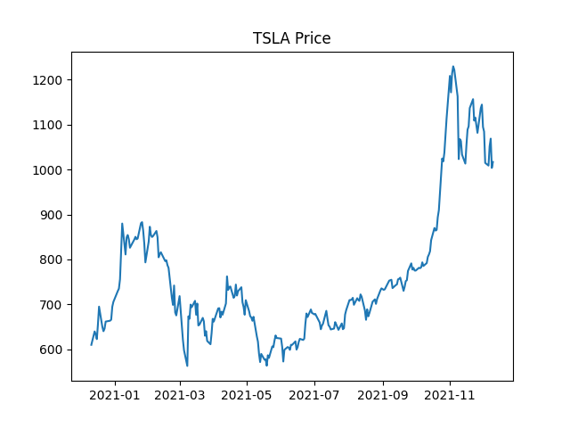

In [mathematical finance][1], [value at risk (VaR)][2] is a statistic that
quantifies the level of risk in a position or portfolio over a specific time
frame. VaR is a measue of [probable maximum loss (PML)][3]—the maximum loss that
the position or portfolio would be expected to incur. Specifically, we are
interested in answering the question, What are the worst 1% of possible
outcomes<!-- end -->?

Suppose we have a position in a stock. How might we go about determining the
worst 1% of possible outcomes for tomorrow? Well, if $P$ is a [random
variable][4] that models tomorrow's closing price, then the 99% probable minimum
closing price $p_0$ satisfies the integral equation

$$
\int_{p_0}^\infty f_P(p) \, dp = \text{Pr}[P \geq p_0] = 0.99,
$$

where $f_P$ is the [probability density function (PDF)][5] of $P$. To solve this
equation for $p_0$, we need to know $f_P$—but how do we get it? To that end, let
$\mathbf{p} = (p_1, \dots, p_n)$ be the sequence of daily closing prices of the
stock for the past $n$ days. For example, $\mathbf{p}$ might be the sequence of
daily closing prices of [Tesla][6] for the past year, plotted below.

If we assume that tomorrow's closing price will be like past closing prices,
then we can use the [frequency distribution][7] of $\mathbf{p}$ to estimate
$f_P$. The frequency of a price $p$ in $\mathbf{p}$ is just the number of
occurrences of $p$ in $\mathbf{p}$, given by $\sum_{i=1}^n \delta_{p_ip}$, where
$\delta_{ij}$ is the [Kronecker delta][8]:

$$
\delta_{ij} = \begin{cases}
0, & i \neq j, \\
1, & i = j.
\end{cases}
$$

The [relative frequency][9] is just the normalized frequency:
$\frac{1}{n}\sum_{i=1}^n \delta_{p_ip}$. It tells us the probability that a
randomly selected $p_i$ will equal $p$. We define the **relative frequency
function (RFF)** of $\mathbf{p}$ to be a function $f_\mathbf{p}(p)$ that gives
the relative frequency of $p$ in $\mathbf{p}$. Symbolically,

$$
f_\mathbf{p}(p) \equiv \frac{1}{n}\sum_{i=1}^n \delta_{p_ip}.
$$

$f_\mathbf{p}$ for our example is represented below as a histogram.

Under our assumptions, $f_P \approx f_\mathbf{p}$. But this plot illustrates a
clear problem with our approach to estimating $f_P$. Based on our approach, TSLA
would be more likely to close around \$700—a _massive_ drop—than around the same
price as yesterday! This seems wildly wrong. The problem lies in our assumption:
tomorrow's closing price will _not_ be like past closing prices—a certain
closing price is not necessarily likely just because the stock has closed at
that price many times in the past. Thus, we are forced to consider alternative
approaches.

A reasonable next step might be to look at _changes_ in price. Let $C$ be a
random variable that models tomorrow's change in price, and define the sequence
$\mathbf{c} = (c_1, \dots, c_{n-1})$ via

$$
c_i = p_{i+1} - p_i,
$$

so that $c_i$ is the change in price on day $i + 1$. $\mathbf{c}$ and
$f_\mathbf{c}$ for our example are plotted below.

This looks much more promising. Our RFF looks fairly [normal][10], so suppose
that $C \sim \mathcal{N(\mu, \sigma^2)}$ for some [mean][11] $\mu$ and
[variance][12] $\sigma^2$. The problem with using changes in price arises when
we try to estimate $\mu$ and $\sigma$ by applying [maximum likelihood estimation
(MLE)][13] to this distribution. If you have studied [linear regression][14],
the idea here is similar: we want to optimize the parameters of our function to
best fit our data. The difference is that we are working with a [Gaussian][15]
(or "bell curve") as opposed to a linear function.

To see the problem, consider $\mathbf{c}$ to be a [sample][16] for the sequence
of random variables $C_1, \dots, C_{n-1}$ that model the change in price on days
$2, \dots, n$, respectively, and suppose that each $C_i$ is normally
distributed, which is reasonable since $C$ is assumed to be normally distributed
and in this context there is nothing special about tomorrow as opposed to, say,
last Thursday. The problem here is that we should _not_ assume that changes in
price are _identically_ distributed—each $C_i$ requires its own parameters:
$C_i \sim \mathcal{N}(\mu_i, \sigma_i^2)$. The reason identical distribution
would be a bad assumption here is that, as anyone who has traded stocks can
attest, changes in price tend to _scale_ with the price itself. (This is why
stock prices often look [exponential][17] over long periods of time: the
defining characteristic of an exponential function $f(x)$ is that it satisfies
the differential equation

$$
\frac{df}{dx} = af(x),
$$

where $a$ is a constant. In this case, the derivative corresponds to the change
in price and the function itself corresponds to the price. From a psychological
perspective, this can be attributed to what is known as the [Weber-Fechner
law][18], which says that the perceived effect of a change depends on the
starting point.) Because of this, estimating the $\mu_i$s and $\sigma_i^2$s
would not get us any closer to estimating $\mu$ and $\sigma^2$. We can account
for this scaling behavior, however—by converting to [returns][19].

Let $R$ be a random variable that models tomorrow's return, and define the
sequence $\mathbf{r} = (r_1, \dots, r_{n-1})$ via

$$
r_i = \frac{c_{i+1}}{p_{i}} = \frac{p_{i+1} - p_i}{p_i},
$$

so that $r_i$ is the return on day $i + 1$. $\mathbf{r}$ and $f_\mathbf{r}$ for
our example are plotted below.

As before, our RFF appears normal, so suppose that
$R \sim \mathcal{N}(\mu, \sigma^2)$ for some $\mu$ and $\sigma^2$ and consider
$\mathbf{r}$ to be a sample for the sequence of random variables
$\mathbf{R} = (R_1, \dots, R_{n-1})$ that model the return on days
$2, \dots, n$, respectively. This time around, since we are dealing with
_percentage_ changes, we _can_ assume identical distribution: each
$R_i \sim \mathcal{N}(\mu, \sigma^2)$. Then the PDF of each $R_i$ is

$$
f_{R_i}(r \mid \mu, \sigma^2) = f_R(r \mid \mu, \sigma^2) = \frac{1}{\sqrt{2\pi\sigma^2}}e^{-(r - \mu)^2/2\sigma^2}.
$$

Furthermore, because we do not expect the return on any given day to depend too
much on past returns, we assume that the $R_i$s are [mutually independent][20].
We can then apply the multiplication rule to obtain their [joint cumulative
distribution function (JCDF)][21]:

$$
\begin{aligned}
F_\mathbf{R}(\mathbf{r_0} \mid \mu, \sigma^2) &\equiv \text{Pr}[R_1 \leq r_{0,1}, \dots, R_{n-1} \leq r_{0,n-1} \mid \mu, \sigma^2] \\
&= \prod_{i=1}^{n-1} \text{Pr}[R_i \leq r_{0,i} \mid \mu, \sigma^2] \\
&= \prod_{i=1}^{n-1} \int_{-\infty}^{r_{0,i}} f_{R_i}(r \mid \mu, \sigma^2) \, dr, \\
&= \prod_{i=1}^{n-1} \int_{-\infty}^{r_{0,i}} f_R(r \mid \mu, \sigma^2) \, dr,
\end{aligned}
$$

where $\mathbf{r_0} = (r_{0,1}, \dots, r_{0,n-1})$ is an arbitrary sample for
$\mathbf{R}$. Their [joint probability density function][22] is then, using the
[fundamental theorem of calculus][23],

$$
\begin{aligned}
f_\mathbf{R}(\mathbf{r_0} \mid \mathbf{\mu}, \mathbf{\sigma^2}) &\equiv \frac{\partial^{n-1}F_\mathbf{R}}{{\partial}r_{0,1}\cdots{\partial}r_{0,n-1}} \\
&= \frac{\partial^{n-1}}{{\partial}r_{0,1}\cdots{\partial}r_{0,n-1}}\prod_{i=1}^{n-1} \int_{-\infty}^{r_{0,i}} f_R(r \mid \mu, \sigma^2) \, dr \\
&= \prod_{i=1}^{n-1} \frac{\partial}{{\partial}r_{0,i}}\int_{-\infty}^{r_{0,i}} f_R(r \mid \mu, \sigma^2) \, dr \\
&= \prod_{i=1}^{n-1} f_R(r_{0,i} \mid \mu, \sigma^2) \\
\end{aligned}
$$

For given parameters $\mu$ and $\sigma^2$, the relative likelihood of observing
$\mathbf{r}$ is given by the [likelihood function][24]:

$$
\begin{aligned}
\mathcal{L}(\mu, \sigma^2) &\equiv f_\mathbf{R}(\mathbf{r} \mid \mu, \sigma^2) \\
&= \prod_{i=1}^{n-1} f_R(r_i \mid \mu, \sigma^2) \\
&= \prod_{i=1}^{n-1} \frac{1}{\sqrt{2\pi\sigma^2}}e^{-(r_i - \mu)^2/2\sigma^2} \\
&= \left(\prod_{i=1}^{n-1} \frac{1}{\sqrt{2\pi\sigma^2}}\right)\left(\prod_{i=1}^{n-1} e^{-(r_i - \mu)^2/2\sigma^2}\right) \\
&= \left(\frac{1}{2\pi\sigma^2}\right)^{(n-1) / 2}\exp\left(\sum_{i=1}^{n-1} -\frac{(r_i - \mu)^2}{2\sigma^2}\right) \\
&= \left(\frac{1}{2\pi\sigma^2}\right)^{(n-1) / 2}\exp\left(-\frac{1}{2\sigma^2}\sum_{i=1}^{n-1} (r_i - \mu)^2\right)
\end{aligned}
$$

We want to find values of $\mathbf{\mu}$ and $\mathbf{\sigma^2}$ that maximize
$\mathcal{L}$. That is, we want to satisfy the equations

$$
\frac{\partial\mathcal{L}}{\partial\mathbf{\mu}} = 0 \quad \text{and} \quad \frac{\partial\mathcal{L}}{\partial\mathbf{\sigma^2}} = 0.
$$

Because of the exponential in $\mathcal{L}$, it is convenient to work with the
[log-likelihood function][25]:

$$
\begin{aligned}
\ell(\mu, \sigma^2) &\equiv \ln \mathcal{L}(\mu, \sigma^2) \\
&= \ln\left[\left(\frac{1}{2\pi\sigma^2}\right)^{(n - 1) / 2}\exp\left(-\frac{1}{2\sigma^2}\sum_{i=1}^{n-1} (r_i - \mu)^2\right)\right] \\
&= \ln\left(\frac{1}{2\pi\sigma^2}\right)^{(n - 1) / 2} + \ln\exp\left(-\frac{1}{2\sigma^2}\sum_{i=1}^{n-1} (r_i - \mu)^2\right) \\
&= \frac{n - 1}{2}\ln \frac{1}{2\pi\sigma^2} - \frac{1}{2\sigma^2}\sum_{i=1}^{n-1} (r_i - \mu)^2.
\end{aligned}
$$

Since the natural logarithm function is monotonically increasing, $\ell$ is
maximized by the same values of $\mu$ and $\sigma^2$ as $\mathcal{L}$. Thus, we
can look at the equations

$$
\frac{\partial\ell}{\partial\mathbf{\mu}} = 0 \quad \text{and} \quad \frac{\partial\ell}{\partial\mathbf{\sigma^2}} = 0.
$$

For the $\mu$ equation, we have

$$
\begin{aligned}
& \begin{aligned}
0 & = \frac{\partial}{\partial\mu}\left(\frac{n - 1}{2}\ln \frac{1}{2\pi\sigma^2} - \frac{1}{2\sigma^2}\sum_{i=1}^{n-1} (r_i - \mu)^2\right) \\
  & = -\frac{1}{2\sigma^2}\sum_{i=1}^{n-1} \frac{\partial}{\partial\mu}(r_i - \mu)^2 \\
  & = \frac{1}{\sigma^2}\sum_{i=1}^{n-1}(r_i - \mu) \\
  & = \frac{1}{\sigma^2}\left(\sum_{i=1}^{n-1} r_i - (n - 1)\mu\right)
\end{aligned} \\
& \implies \sum_{i=1}^{n-1} r_i - (n - 1)\mu = 0 \\
& \implies (n - 1)\mu = \sum_{i=1}^{n-1} r_i \\
& \implies \mu = \frac{1}{n - 1}\sum_{i=1}^{n-1} r_i,
\end{aligned}
$$

which is just the arithmetic mean. For the $\sigma^2$ equation, we have

$$
\begin{aligned}
& \begin{aligned}
0 & = \frac{\partial}{\partial\sigma^2}\left(\frac{n - 1}{2}\ln \frac{1}{2\pi\sigma^2} - \frac{1}{2\sigma^2}\sum_{i=1}^{n-1} (r_i - \mu)^2\right) \\
  & = -\frac{n - 1}{2\sigma^2} + \frac{1}{2\sigma^4}\sum_{i=1}^{n-1} (r_i - \mu)^2
\end{aligned} \\
& \implies -(n - 1)\sigma^2 + \sum_{i=1}^{n-1} (r_i - \mu)^2 = 0 \\
& \implies (n - 1)\sigma^2 = \sum_{i=1}^{n-1} (r_i - \mu)^2 \\
& \implies \sigma^2 = \frac{1}{n - 1}\sum_{i=1}^{n-1} (r_i - \mu)^2.
\end{aligned}
$$

With $\mu$ and $\sigma$ in hand, we are now in a position to consider the
integral equation

$$
0.99 = \int_{r_0}^\infty f_R(r) \, dr = \frac{1}{\sqrt{2\pi\sigma^2}}\int_{r_0}^\infty e^{-(r - \mu)^2/2\sigma^2} \, dr.
$$

As it happens, Gaussians are not antidifferentiable, so we cannot compute this
integral analytically, but we have, in principle, arrived at the answer to our
question. Of course, principle does not help you assess real-world risk, so it
is important to know that this integral _can_ be calculated numerically. In
fact, because Gaussians are so ubiquitous, they have been well-studied, and
numeric approximations of their integrals can be readily found in tables. In
this case, the solution is

$$
r_0 = -2.33\sigma.
$$

Therefore, to estimate the 99% probable minimum loss for tomorrow, you can
simply multiply the historical standard deviation of the stock by $2.33$.

### Sources

- https://www.youtube.com/watch?v=92WaNz9mPeY
- https://ocw.mit.edu/courses/mathematics/18-s096-topics-in-mathematics-with-applications-in-finance-fall-2013/lecture-notes/MIT18_S096F13_lecnote7.pdf
- "The Physics of Wall Street: A Brief History of Predicting the Unpredictable"
  by James Owen Weatherall

[1]: https://en.wikipedia.org/wiki/Mathematical_finance
[2]: https://www.investopedia.com/terms/v/var.asp
[3]: https://www.investopedia.com/terms/p/probable-maximum-loss-pml.asp
[4]: https://en.wikipedia.org/wiki/Random_variable
[5]: https://en.wikipedia.org/wiki/Probability_density_function
[6]: https://www.tesla.com
[7]: https://en.wikipedia.org/wiki/Frequency_distribution
[8]: https://en.wikipedia.org/wiki/Kronecker_delta
[9]: https://en.wikipedia.org/wiki/Frequency_(statistics)#Types
[10]: https://en.wikipedia.org/wiki/Normal_distribution
[11]: https://en.wikipedia.org/wiki/Mean
[12]: https://en.wikipedia.org/wiki/Variance
[13]: https://en.wikipedia.org/wiki/Maximum_likelihood_estimation
[14]: https://en.wikipedia.org/wiki/Linear_regression
[15]: https://en.wikipedia.org/wiki/Gaussian_function
[16]: https://en.wikipedia.org/wiki/Sample_(statistics)
[17]: https://en.wikipedia.org/wiki/Exponential_function
[18]: https://en.wikipedia.org/wiki/Weber%E2%80%93Fechner_law
[19]: https://www.investopedia.com/terms/r/return.asp
[20]: https://en.wikipedia.org/wiki/Independence_(probability_theory)
[21]:
  https://en.wikipedia.org/wiki/Joint_probability_distribution#Joint_cumulative_distribution_function
[22]:
  https://en.wikipedia.org/wiki/Joint_probability_distribution#Continuous_case
[23]: https://en.wikipedia.org/wiki/Fundamental_theorem_of_calculus
[24]: https://en.wikipedia.org/wiki/Likelihood_function
[25]: https://en.wikipedia.org/wiki/Likelihood_function#Log-likelihood
